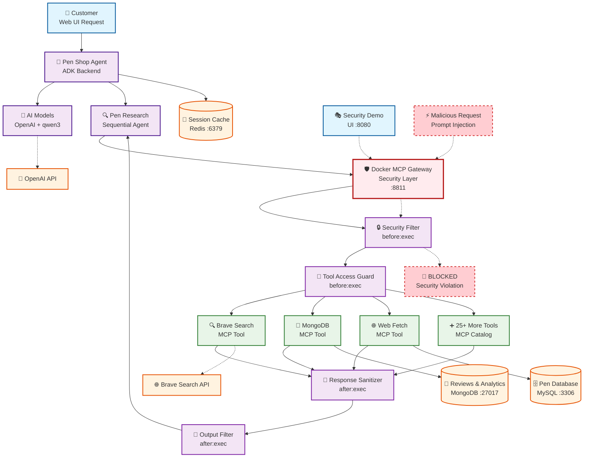

# 🖊️ Moby Pen Shop Platform


🖊️ Multi-Agent Pen Shop - MCP Security Demo Platform



## Quick Start

### Prerequisites
- **Docker & Docker Compose** installed
- **8GB+ RAM** (for AI models)
- **OpenAI API Key** ([Get one here](https://platform.openai.com/api-keys))

### Setup Instructions

1. **Clone the repository:**
   ```bash
   git clone https://github.com/ajeetraina/pen-shop-demo
   cd pen-shop-demo
   ```

2. **Add your OpenAI API key:**
   ```bash
   echo "your-actual-openai-api-key" > secret.openai-api-key
   ```

3. **Add your Brave Search key :**
   ```
   bash
   export BRAVE_API_KEY=XXXX
   ```


3. **Start the platform:**
   ```bash
   docker compose up -d --build
   ```

4. **Access the applications:**
   - 🏪 **Main Store**: http://localhost:9090
   - 🤖 **AI Assistant**: http://localhost:3000
   - 📦 **Catalogue API**: http://localhost:8081/catalogue
   - 🧠 **Agent API**: http://localhost:8000/api/health


## Service Details

| Service | Technology | Port | Purpose |
|---------|------------|------|---------|
| `pen-frontend` | React + Nginx | 9090 | E-commerce store UI |
| `pen-catalogue` | Node.js + Express | 8081 | Product catalog API |
| `adk-backend` | Go + Gorilla Mux | 8000 | AI agent backend |
| `adk-ui` | React + Nginx | 3000 | AI chat interface |
| `catalogue-db` | MySQL 8.0 | 3306 | Product database |
| `mongodb` | MongoDB | 27017 | Reviews & AI data |


### **Sample Conversations**
```
I need a fountain pen for daily journaling
```
```
I Liked Montblanc
```
```
What's the difference between ballpoint and rollerball?
```
```
Show me luxury pens under $100
```


