# 🖊️ Multi-Agent Pen Shop - MCP Security Demo Platform
*AI Shopping Assistant with Docker MCP Gateway & Security Interceptors*


A complete multi-agent e-commerce platform showcasing **secure AI interactions** through:
- 🤖 **Multi-Agent Architecture** - Collaborative AI agents for shopping assistance
- 🛡️ **MCP Security Gateway** - Docker-based interceptors protecting 25+ tools
- 🔍 **Sequential Research Agents** - Intelligent pen recommendation system
- ⚡ **Real-time Attack Simulation** - Built-in security testing framework

Built with Docker, React, Go, Node.js, and powered by OpenAI + Qwen3 models.

```
Frontend → ADK Backend → MCP Gateway → [Interceptors] → OpenAI API → Response
```




```mermaid

flowchart TD
    %% User Layer
    Customer[🛒 Customer<br/>Web UI Request]
    
    %% Agent Layer  
    Agent[🤖 Pen Shop Agent<br/>ADK Backend]
    
    %% AI Models
    LLM[🧠 AI Models<br/>OpenAI + qwen3]
    
    %% Research & Analysis
    Research[🔍 Pen Research<br/>Sequential Agent]
    
    %% Security Gateway (Central Component)
    Gateway[🛡️ Docker MCP Gateway<br/>Security Layer<br/>:8811]
    
    %% Security Interceptors
    SecurityFilter[🔒 Security Filter<br/>before:exec]
    ToolGuard[🚫 Tool Access Guard<br/>before:exec] 
    Sanitizer[🧹 Response Sanitizer<br/>after:exec]
    OutputFilter[📏 Output Filter<br/>after:exec]
    
    %% MCP Tools
    BraveSearch[🔍 Brave Search<br/>MCP Tool]
    MongoDB[🍃 MongoDB<br/>MCP Tool]
    WebFetch[🌐 Web Fetch<br/>MCP Tool]
    MoreTools[➕ 25+ More Tools<br/>MCP Catalog]
    
    %% Data Sources
    PenDB[(🗄️ Pen Database<br/>MySQL :3306)]
    ReviewDB[(📝 Reviews & Analytics<br/>MongoDB :27017)]
    Cache[(🔄 Session Cache<br/>Redis :6379)]
    
    %% External APIs
    BraveAPI[🌐 Brave Search API]
    OpenAI_API[🤖 OpenAI API]
    
    %% Demo Interface
    Demo[🎭 Security Demo<br/>UI :8080]
    
    %% Flow Connections
    Customer --> Agent
    Demo -.-> Gateway
    Agent --> LLM
    Agent --> Research
    
    %% Security Gateway Flow
    Research --> Gateway
    Gateway --> SecurityFilter
    SecurityFilter --> ToolGuard
    ToolGuard --> BraveSearch
    ToolGuard --> MongoDB  
    ToolGuard --> WebFetch
    ToolGuard --> MoreTools
    
    %% Response Flow (through security)
    BraveSearch --> Sanitizer
    MongoDB --> Sanitizer
    WebFetch --> Sanitizer
    MoreTools --> Sanitizer
    Sanitizer --> OutputFilter
    OutputFilter --> Research
    
    %% Tool to Data Connections
    BraveSearch -.-> BraveAPI
    MongoDB --> ReviewDB
    WebFetch --> PenDB
    Agent --> Cache
    LLM -.-> OpenAI_API
    
    %% Attack Flow (blocked)
    Attack[⚡ Malicious Request<br/>Prompt Injection] -.-> Gateway
    Gateway -.-> SecurityFilter
    SecurityFilter -.-> Block[🚫 BLOCKED<br/>Security Violation]
    
    %% Styling
    classDef userClass fill:#e1f5fe,stroke:#01579b,stroke-width:2px
    classDef agentClass fill:#f3e5f5,stroke:#4a148c,stroke-width:2px
    classDef securityClass fill:#ffebee,stroke:#b71c1c,stroke-width:3px
    classDef interceptorClass fill:#f3e5f5,stroke:#7b1fa2,stroke-width:2px
    classDef toolClass fill:#e8f5e8,stroke:#2e7d32,stroke-width:2px
    classDef dataClass fill:#fff3e0,stroke:#e65100,stroke-width:2px
    classDef attackClass fill:#ffcdd2,stroke:#d32f2f,stroke-width:2px,stroke-dasharray: 5 5
    
    class Customer,Demo userClass
    class Agent,Research,LLM agentClass
    class Gateway securityClass
    class SecurityFilter,ToolGuard,Sanitizer,OutputFilter interceptorClass
    class BraveSearch,MongoDB,WebFetch,MoreTools toolClass
    class PenDB,ReviewDB,Cache,BraveAPI,OpenAI_API dataClass
    class Attack,Block attackClass
```

## Quick Start

### Prerequisites
- **Docker & Docker Compose** installed
- **8GB+ RAM** (for AI models)
- **OpenAI API Key** ([Get one here](https://platform.openai.com/api-keys))

### Setup Instructions

1. **Clone the repository:**
   ```bash
   git clone https://github.com/ajeetraina/pen-shop-demo
   cd pen-shop-demo
   ```

2. **Add your OpenAI API key:**
   ```bash
   echo "your-actual-openai-api-key" > secret.openai-api-key
   ```

3. **Add your Brave Search key :**
   ```
   bash
   export BRAVE_API_KEY=XXXX
   export RESEND_API_KEY=XXX
   ```

   OR

   Add the keys under `.mcp.env` file as:

   ```
   # MCP Server configuration
   BRAVE_API_KEY=XX
   RESEND_API_KEY=re_XXXX
   ```


3. **Start the platform:**
   ```bash
   docker compose up -d --build
   ```

```
   [+] Running 8/8
 ✔ Network pen-shop-demo_pen-shop-network   Created                                                0.0s 
 ✔ Container pen-shop-demo-mongodb-1        Started                                                0.5s 
 ✔ Container pen-shop-demo-catalogue-db-1   Started                                                0.5s 
 ✔ Container pen-shop-demo-mcp-gateway-1    Started                                                0.6s 
 ✔ Container pen-shop-demo-pen-catalogue-1  Started                                                0.6s 
 ✔ Container pen-shop-demo-adk-backend-1    Started                                                0.7s 
 ✔ Container pen-shop-demo-pen-frontend-1   Started                                                0.7s 
 ✔ Container pen-shop-demo-adk-ui-1         Started                                                0.8s 
```

4. **Access the applications:**
   - 🏪 **Main Store**: http://localhost:9090
   - 🤖 **AI Assistant**: http://localhost:3000
   - 📦 **Catalogue API**: http://localhost:8081/catalogue
   - 🧠 **Agent API**: http://localhost:8000/api/health


## Service Details

```
| Service | Technology | Port | Purpose |
|---------|------------|------|---------|
| `pen-frontend` | React + Nginx | 9090 | E-commerce store UI |
| `pen-catalogue` | Node.js + Express | 8081 | Product catalog API |
| `adk-backend` | Go + Gorilla Mux | 8000 | AI agent backend |
| `adk-ui` | React + Nginx | 3000 | AI chat interface |
| `catalogue-db` | MySQL 8.0 | 3306 | Product database |
| `mongodb` | MongoDB | 27017 | Reviews & AI data |
```


### **Sample Conversations**

```
I need a fountain pen for daily journaling
```

```
I Liked Montblanc
```

```
What's the difference between ballpoint and rollerball?
```

```
Show me luxury pens under $10
```

## Pen Guard Interceptors

Interceptors are one of the most powerful security features of Docker MCP Gateway.
They act as programmable security filters/middleware that sit between AI clients and MCP tools.
They act as security guards that inspect, modify, or block every tool call in real-time.

```
sh test-interceptors.sh 

Test 1: Negative price attack...
[PEN-GUARD] Checking request
[BLOCKED] Negative price detected!
{"error": "Negative prices not allowed!", "blocked": true}

Test 2: SQL injection attempt...
[PEN-GUARD] Checking request
[BLOCKED] SQL injection detected!
{"error": "SQL injection blocked!", "blocked": true}

Test 3: Prompt injection...
[PEN-GUARD] Checking request
[BLOCKED] Prompt injection detected!
{"error": "Prompt injection blocked!", "blocked": true}

Test 4: Valid query (should pass)...
[PEN-GUARD] Checking request
[PEN-GUARD] Request approved
{"method":"search","params":{"category":"luxury"}}

Test 5: Data masking test...
[DATA-PROTECTOR] Processing response
{"credit_card":"****-****-****-****"}

✅ Tests completed
```

Successfully blocking malicious requests:

- Test 1: Blocked negative price attack (-$100 price attempt)
- Test 2: Blocked SQL injection ("DROP TABLE" in query)
- Test 3: Blocked prompt injection ("ignore previous instructions")
- Test 4: Correctly allowed legitimate query (luxury category search)

## DATA-PROTECTOR Interceptor ✅

- Test 5: Successfully masked sensitive credit card data (4111-1111-1111-1111 → ---)

This demonstrates that your Docker MCP Gateway interceptors are:

- Detecting and blocking multiple attack vectors (injection attacks, data manipulation)
- Allowing legitimate traffic through without interference
- Protecting sensitive data by masking it in responses
- Operating as real-time security filters between AI clients and MCP tools

This is exactly how Docker MCP Gateway interceptors should work - as "security guards that check every message going in and out of your MCP tools".


